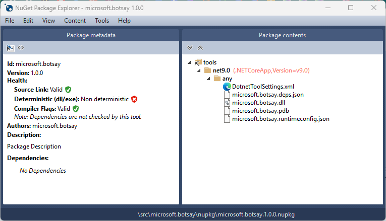
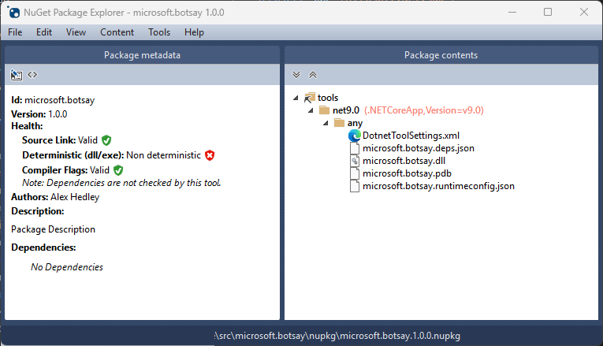
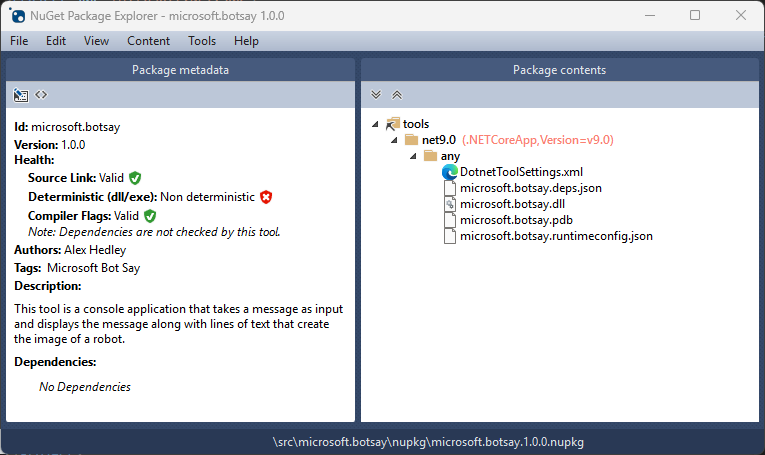
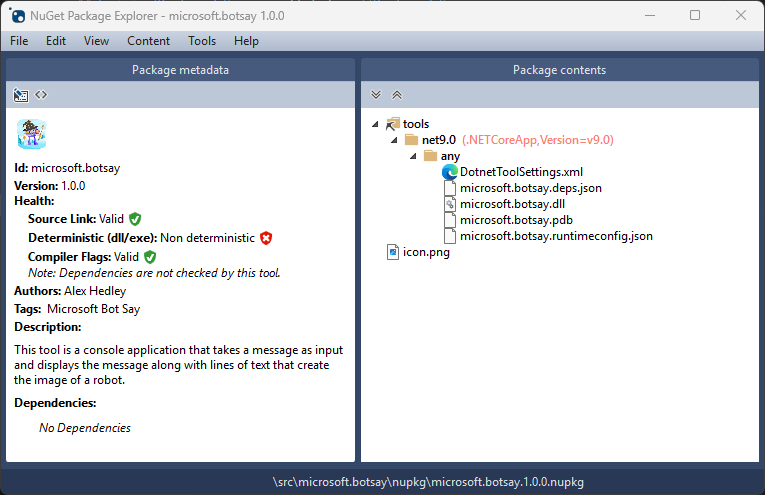
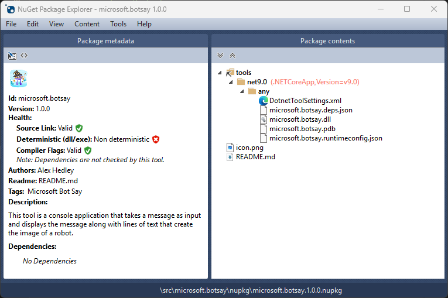
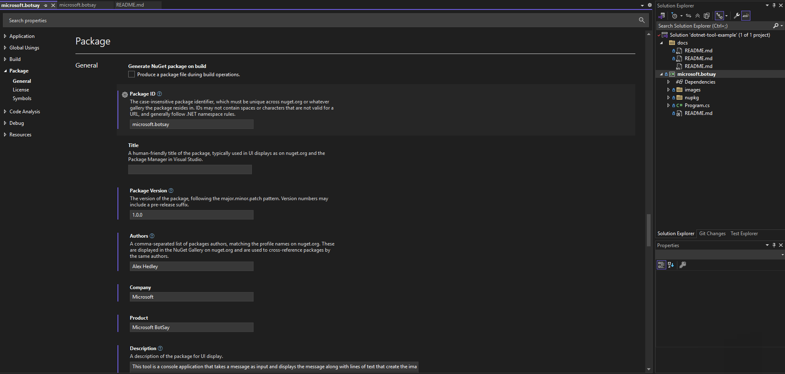
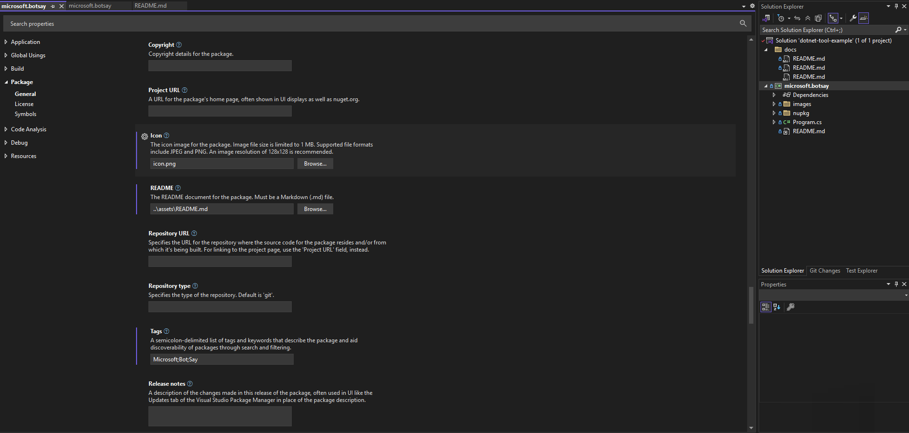
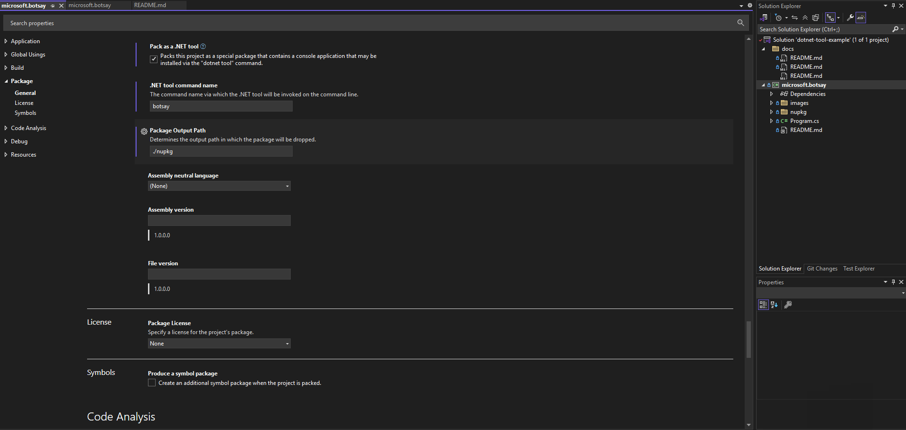
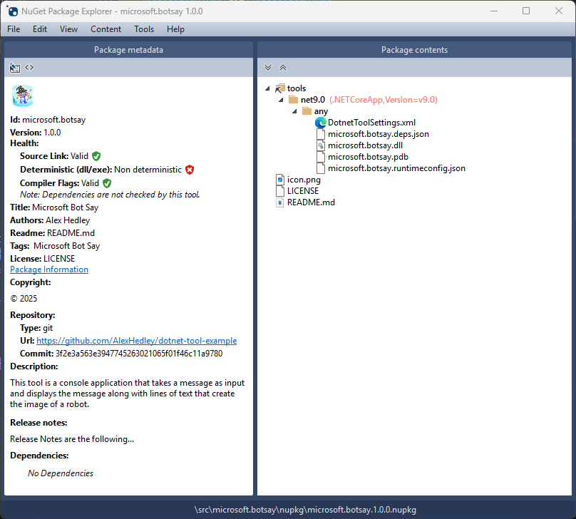

# Package

NuGet Package Explorer
- https://apps.microsoft.com/detail/9wzdncrdmdm3?hl=en-gb&gl=US



NuGet documentation
- https://learn.microsoft.com/en-us/nuget/

Package creation workflow
- https://learn.microsoft.com/en-us/nuget/create-packages/overview-and-workflow

---

Initial Properties

- [microsoft.botsay.csproj](src/microsoft.botsay/microsoft.botsay.csproj)


Added `PackageId`, `Version`, `Authors`, `Company` and `Product`



Added `PackageTags` and `Description`



## Icon

https://github.com/NuGet/Home/wiki/Packaging-Icon-within-the-nupkg

```xml
<PackageIcon>icon.png</PackageIcon>
```

```xml
<ItemGroup>
  ...
  <None Include="images\icon.png" Pack="true" PackagePath=""/>
  ...
</ItemGroup>
```

Use https://mod-dotnet-bot.net/gallery/


> Size recommendation - 128x128 (on nuget.org we use a max of 76.5x76.5 and in VS 32x32)



## Readme

https://github.com/NuGet/Home/wiki/Embedding-and-displaying-NuGet-READMEs

```xml
<PropertyGroup>
    <PackageReadmeFile>readme.md</PackageReadmeFile>
</PropertyGroup>
```

```xml
<ItemGroup>
    <None Include="..\assets\README.md" Pack="true" PackagePath=""/>
</ItemGroup>
```



---

# VS





---

## Others



- requireLicenseAcceptance
- projectUrl
- licenseUrl `<license type="expression">MIT</license>`
- repository
- copyright ?
